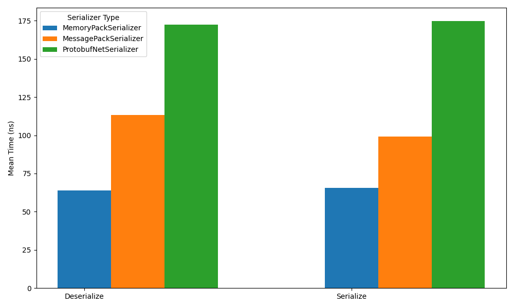

### Serializers

| Name                                                                    | Attribute         | Description                                         |
|:------------------------------------------------------------------------|-------------------|-----------------------------------------------------|
| [MemoryPack](https://github.com/Cysharp/MemoryPack)                     | MemoryPackable    | Zero encoding extreme performance binary serializer |
| [MessagePack](https://github.com/MessagePack-CSharp/MessagePack-CSharp) | MessagePackObject | Extremely fast MessagePack serializer               |
| [protobuf-net](https://github.com/protobuf-net/protobuf-net)            | ProtoContract     | Contract based protocol buffers serializer          |

---
### Benchmarks
Benchmark results will vary on different systems and environments. Conduct your own benchmarks to evaluate performance for
your use case if warranted. Note that serializers produce varying byte sizes which impact performance and storage, thus speed is not universally the best measure for success.

**Environment**: .NET SDK 9.0.1, Windows 11, i9-10900 CPU 2.80GHz

*Benchmarks when (de)serializing a [Person](benchmarks/HybridCache.Serializers.Benchmarks/Models/Person.cs) object.*

---
### Notes

* `IHybridCacheSerializerFactory` implementations yield serializers for types with the respective serializer attribute
  by default (e.g., `MemoryPackable` for MemoryPack). Override `SupportsType<T>()` to customize type support.
